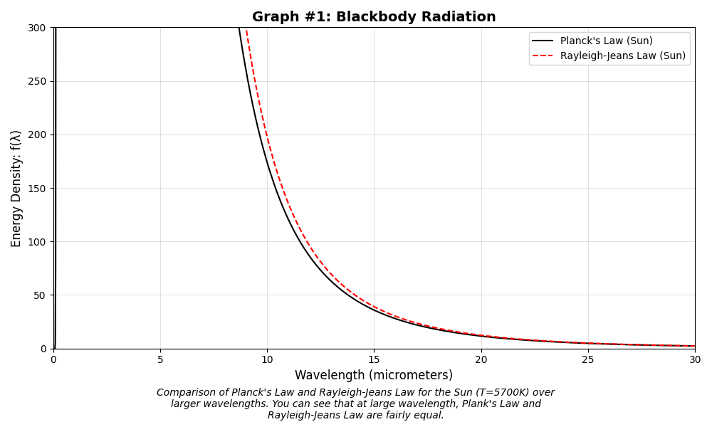
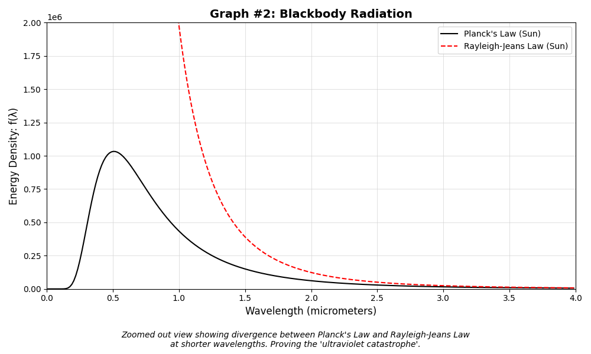
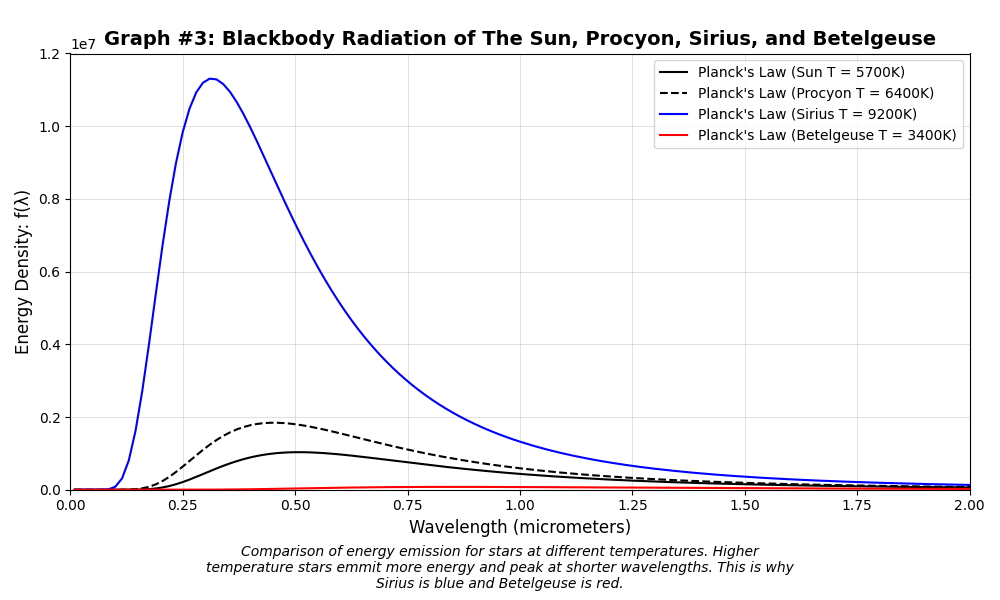

# Blackbody Radiation Visualization with Python
<!-- # = Level 1 heading (project title) -->

## Overview
<!-- ## = Level 2 heading -->

This project visualizes **blackbody radiation** using **Planck’s Law** and compares it to the **Rayleigh–Jeans approximation** across different wavelength ranges. It also explores how temperature affects the radiation curves of different stars (the Sun, Procyon, Sirius, and Betelgeuse).

The goal of this project is to:
- Demonstrate the failure of classical physics at short wavelengths (the *ultraviolet catastrophe*)
- Show why Planck’s Law correctly models blackbody radiation
- Visualize how stellar temperature determines color and peak emission

---

## Concepts Covered

- Planck’s Law of blackbody radiation  
- Rayleigh–Jeans Law (classical approximation)  
- Ultraviolet catastrophe  
- Relationship between temperature and peak wavelength  
- Stellar color and energy distribution  

<!-- The two spaces at the end of a line force a line break in Markdown -->

---

## Technologies Used

- **Python**
- **NumPy** – numerical computations and array handling  
- **Matplotlib** – data visualization and plotting  

<!-- **bold** is done with double asterisks -->

---

## How It Works

### 1. Constants and Parameters
<!-- ### = Level 3 heading -->

- Physical constants (`h`, `c`, `k`) are defined using SI units.
- Temperatures are specified for:
  - Sun (5700 K)
  - Procyon (6400 K)
  - Sirius (9200 K)
  - Betelgeuse (3400 K)

<!-- Backticks `like this` are for inline code -->

---

### 2. Wavelength Range

- Wavelengths are generated from **0.01 to 30 micrometers** and converted to meters.
- This avoids division-by-zero errors and allows both long- and short-wavelength behavior to be studied.

---

### 3. Radiation Models

- **Planck’s Law** is computed for each star.
- **Rayleigh–Jeans Law** is computed for comparison with Planck’s Law.

---

### 4. Visualization

- Multiple plots are generated to highlight different physical behaviors.

---

## Plots Explained

### Graph 1: Planck vs Rayleigh–Jeans (0–30 μm)


<!--  is the image syntax -->

- Shows that at **long wavelengths**, Planck’s Law and Rayleigh–Jeans Law closely agree.
- Demonstrates why the classical approximation works only in this regime.

---

### Graph 2: Planck vs Rayleigh–Jeans (0–4 μm)



- Zooms into short wavelengths.
- Clearly shows the **ultraviolet catastrophe**, where Rayleigh–Jeans diverges while Planck’s Law remains finite.

---

### Graph 3: Blackbody Radiation of Different Stars



- Compares Planck curves for the Sun, Procyon, Sirius, and Betelgeuse.
- Hotter stars:
  - Emit more total energy
  - Peak at shorter wavelengths
- Explains why **Sirius appears blue** and **Betelgeuse appears red**.

---

## How to Run

1. Make sure Python is installed.
2. Install required libraries:

```bash
pip install numpy matplotlib
